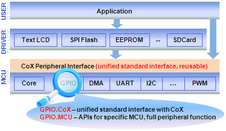

@if (DOXYGEN_PROJECT)
@defgroup LPC17xx_Cox
@endif

# CoX Library 3.0 

CoX Peripheral Library is the definition of a group of interface functions. 
It defines the functional access functions of MCU’s common peripherals, such as IIC, SPI, 
UART, etc. CoX makes full functions, drivers based on CoX can be ported to other MCU easily.

#### CoX Peripheral Library can be divided into four parts: 
* Common mandatory type interface.
* Common type of non-mandatory interface.
* MCU-specific interface.
* MCU register interface.

# Features :
* Free and open source under BSD license
* Peripherals library with a unified standard interface, can be ported to other MCUs easily
* Full functions of the peripheral, CoX still provides a set of APIs for special MCU features
* Support interrupt, CoX extracts a set of interrupt events
* A lot of reused drivers
* Extensive documentation generated using doxygen standard
* Standard definition of the API reference for almost all the Cortex-M0/M3 MCU manuals
* Add a new innovative element, such as the short pin (PA2) in GPIO module
* Strict coding standard and does not affect code size and speed, through rigorous testing and verification
* Configurable
* Provide blank template to make port more easily
 
# Why do we use CoX ?
* CoX Peripheral is not only a common interface for drivers, but also a full peripheral library
* CoX function interface unify the definition of the access functions of MCU’s common peripherals, which makes you port programs among different MCUs more conveniently.
* CoX has a set of specific realization for each MCU, and its code size and speed are nearly the same as the library that the suppliers provided.

# When should we use CoX ?
* If users may change MCU in the future and do not want to do too much unnecessary port work.
* If users plan to use the existing drivers based on CoX interface.

# How to use CoX ?
CoX is a group of APIs and Macros who have the prefix x. such as  xGPIOPinRead(), etc..
Click [here](http://www.coocox.org/Cox.html) to see more about how to use CoX. 

## About CooCox
1. If you are an newbie, please read this docunment first  
learn to write beautiful documents in 5-minutes
2. Before you ask for help, read this FAQ first, which can solove 90% problem!
3. If you have any qustion about [coocox](http://www.coocox.org/), please feel free to write to us.
Email: [master@coocox.com](master@coocox.com)